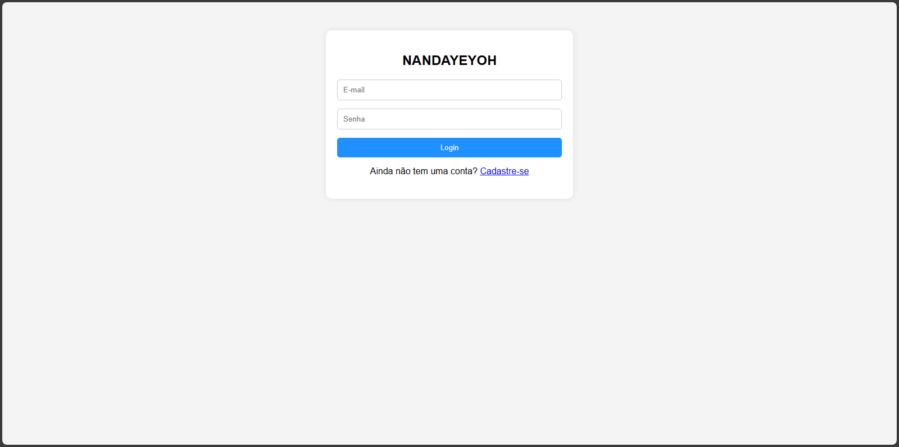
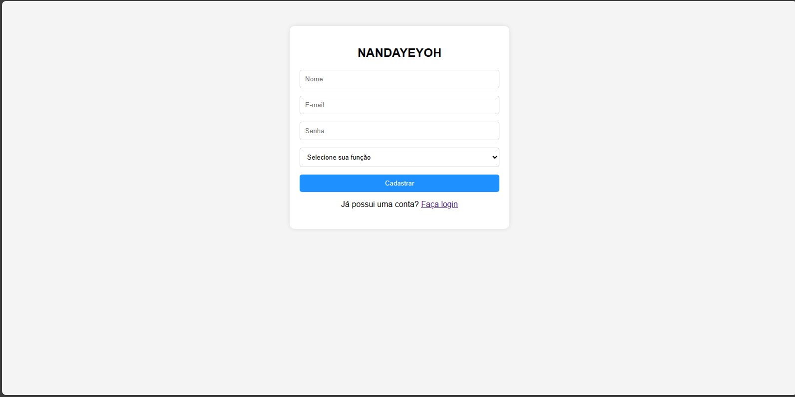
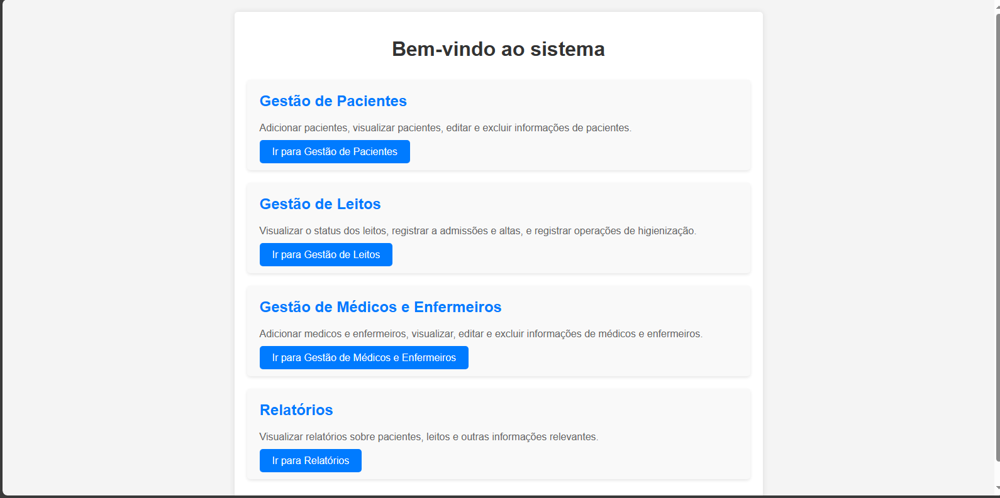

# Sistema Hospitalar NANDAYEYOH

Este é um sistema hospitalar que oferece funcionalidades de cadastro de pacientes, médicos, registro de internações e consultas de pacientes, médicos e internações.


## Screenshots

### Página de Login



### Cadastro de Usuários



### Dashboard Principal


## Tecnologias Utilizadas

- HTML
- CSS
- JavaScript
- PHP
- MySQL

## Funcionalidades

- **Login de Usuários:** Os usuários podem fazer login como médicos, enfermeiros ou administradores.
- **Cadastro de Usuários:** Novos usuários podem se cadastrar no sistema, escolhendo sua função (médico, enfermeiro ou administrador).
- **Verificação de Dados de Login:** O sistema verifica a validade dos dados de login antes de permitir o acesso.
- **Armazenamento Seguro de Senhas:** As senhas dos usuários são armazenadas de forma segura no banco de dados.
- **Cadastro de Pacientes:** Permite o cadastro de novos pacientes no sistema.
- **Cadastro de Médicos:** Permite o cadastro de novos médicos no sistema.
- **Registro de Internações:** Permite o registro de internações de pacientes.
- **Relatorios:** Oferece relatorios de pacientes, médicos e internações.

# Estrutura do Projeto

- **index.php:** Página inicial do sistema.
- **assets/:** Contém os recursos do sistema, como páginas HTML, estilos CSS, scripts JavaScript e arquivos relacionados ao banco de dados.
  - **html/:** Armazena as diferentes páginas do sistema.
  - **css/:** Contém os arquivos CSS para estilização das páginas.
  - **js/:** Aqui estão os scripts JavaScript para tornar as páginas interativas.
  - **php/:** Mantém os arquivos relacionados à conexão com o banco de dados e outras operações no servidor.
  - **db/:** Inclui o script SQL para criação da estrutura do banco de dados.

## Pré-requisitos

Antes de usar o sistema, certifique-se de ter os seguintes requisitos:

- Um servidor web (por exemplo, Apache, XAMPP, WAMP) com suporte a PHP.
- Um banco de dados MySQL.
- PHP instalado.

## Configuração do Banco de Dados

Para configurar o banco de dados, siga estas etapas:

1. Utilize o MySQL e copie o conteúdo do arquivo `database.sql` para criar a estrutura do banco de dados.
2. Configure as credenciais do banco de dados no arquivo `conexao.php`. Se houver credenciais especiais para acessar o banco de dados localmente, certifique-se de incluí-las.

## Como Usar

Siga estas etapas para começar a usar o sistema:

1. Clone este repositório para o diretório do seu servidor web.

```
git clone https://github.com/RodriguesFundo/nandayeyoh
```

2. Configure o banco de dados conforme as instruções acima.
3. Acesse o sistema através do seu navegador web.

## Autor


[Rodrigues Fundo](https://rodriguesfundo.netlify.app/) - Desenvolvedor do projeto

## Contribuições

Contribuições são bem-vindas! Sinta-se à vontade para abrir uma issue ou enviar um pull request.


## Licença

Este projeto está licenciado sob a Licença MIT
